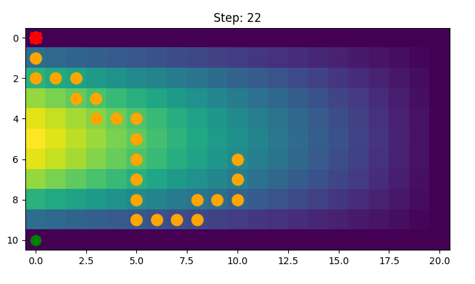

# An Uneven Maze Environment
[](https://github.com/pylint-dev/pylint)


This is a simple maze environment with uneven terrain, offering a simple setup for a multi-objective optimization.
Currently the maze does not have an obstacle in it, but it can be easily added. The environment is implemented to be compatible with
[Gymnasium v0.28.1](https://gymnasium.farama.org/v0.28.1/) and therefore can be used with any of the RL packages that are compatible with Gymnasium.

The agent is a point mass, living on a uniform grid and moving in fixed size steps. The agent starts from a random starting point and there is a fixed
goal position. The agent receives a dense reward signal, which is composed of weighted costs associated with:
- moving in any direction, and also
- moving uphill (moving downhill is cost free). This part of the reward mimics the energy cost of moving uphill.

Changing the weights for costs allow the user to optimize for:
* quickest path to solution,
* least fuel costly, or
* any weighted combination of the two.

Here is a figure of an unfinished episode of the environment:

where the starting point is shown by a red circle, the agent is shown by a orange circle and the final destination is
shown by a green circle. The height profile of the terrain is shown by the background color, where the brighter the color
the higher the terrain. The agent can move in any direction, but moving uphill is more costly than moving downhill.

The agent is configured by a dictionary, which is passed to the environment as `env_config` argument. The items in this dictionary are explained below.oo far.

## The observations
The observation space is a 1D vector of size 4:
- the cost associated with unit of energy for going uphill
- the cost associated with taking any step (no matter the direction)
- x position
- y position

## The actions
The agent can move in 2D space. The action space is discrete and the agent can move to any of its 8 nearest neighbors.

## The termination condition
The agent terminates when it reaches the goal position.

## The truncation condition
The agent is truncated if  by a fixed number steps the agent has not yet reached the goal. This limit is
set by the user in `env_config` dictionary.

## The reward function
As long as the agent has not reached the goal position, the reward sum of the following costs:
- the cost associated with unit of energy for going uphill x the amount of uphill movement
- the cost associated with taking any step (no matter the direction)

When the agent is reaches the goal position, the reward is set to 0.

## Initial state distribution
The agent is initialized at a random position in the grid, with a random cost for moving uphill and a random cost for taking a step.
The user can set the range of these random values in `env_config` dictionary. The position of the goal is fixed and set by the user in `env_config` dictionary.

# Installation
First we create a virtual environment and activate it:
```python
conda create -n unevenmazeenv python=3.10
```
Then we clone and install the package:
```
git clone git@github.com:nima-siboni/uneven_maze.git
cd uneven_maze
pip install -e .
```
You can also install the pre-commit hooks:
```
pre-commit install
```
# Usage
The environment can be used as follows:
```python
import gymnasium as gym
from uneven_maze import sample_terrain_function, UnevenMaze
config = {
    'width': 20,
    'height': 10,
    'mountain_height': 1., # the heighest point of the terrain; this is a parameter of the terrain function
    'start_position': [0, 0],
    'goal_position': [10, 0],
    'max_steps': 100,
    'cost_height_max': 1.,
    'cost_height_min': 0.,
    'cost_step_max': 1.,
    'cost_step_min': 1.,
    'terrain_function': sample_terrain_function # in this case we use the default terrain function
}

env = UnevenMaze(config)

env.reset()
```

For evaluation purposes, the environment can be reseted such that the random values are fixed:
```python
config = {
    'width': 20,
    'height': 10,
    'mountain_height': 1., # the heighest point of the terrain; this is a parameter of the terrain function
    'start_position': [0, 0],
    'goal_position': [10, 0],
    'max_steps': 100,
    'cost_height_max': 1.,
    'cost_height_min': 0.,
    'cost_step_max': 1.,
    'cost_step_min': 1.,
    'terrain_function': sample_terrain_function # in this case we use the default terrain function
}

env = UnevenMaze(config)

options = {"cost_step": 0.0, # Any fixed desired value
           "cost_height": 3.14, # Any fixed desired value
           "start_position": [0, 0] # Any fixed desired position
           }

env.reset(options=options)
```
